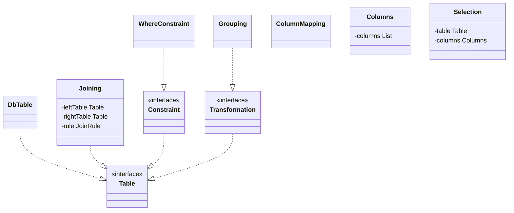

```mermaid
classDiagram
    class Table {
        <<interface>>
    }
    
    class DbTable 
    DbTable ..|> Table
    
    class Joining {
        -leftTable Table
        -rightTable Table
        -rule JoinRule
    }
    Joining ..|> Table
    
    class Constraint {
        <<interface>>
    }
    Constraint ..|> Table
    
    class WhereConstraint { 
        
    }
    WhereConstraint ..|> Constraint
    
    class Transformation { 
        <<interface>>
    }
    Transformation ..|> Table
    
    class Grouping 
    Grouping ..|> Transformation
    
    class ColumnMapping 
    
    class Columns {
        -columns List<Column>
    }

    class Selection {
        -table Table
        -columns Columns
    }
```