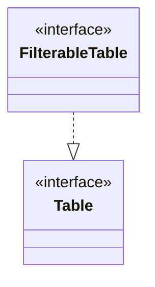
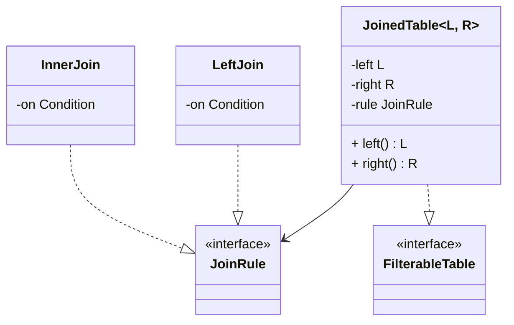
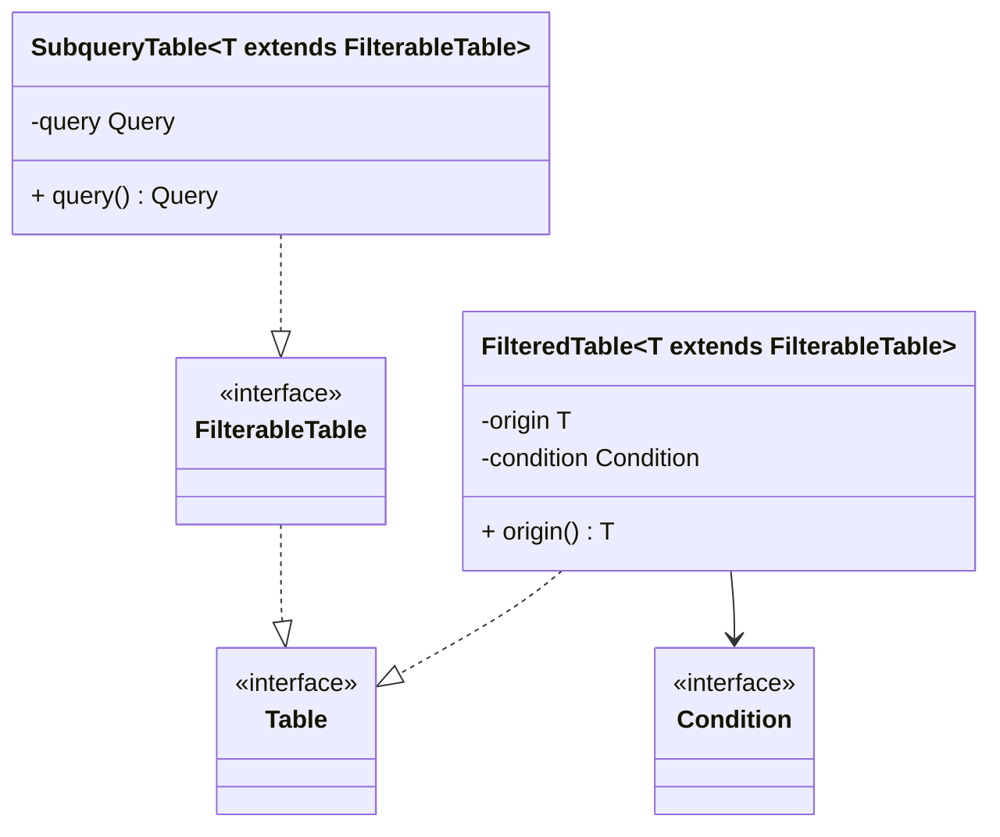
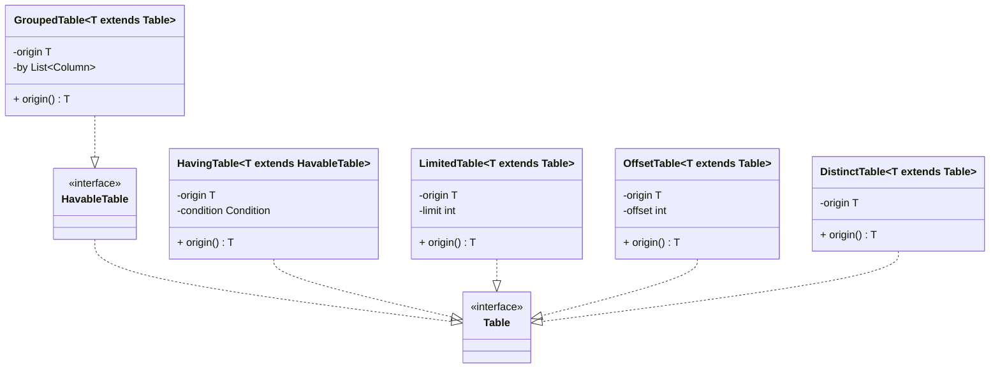
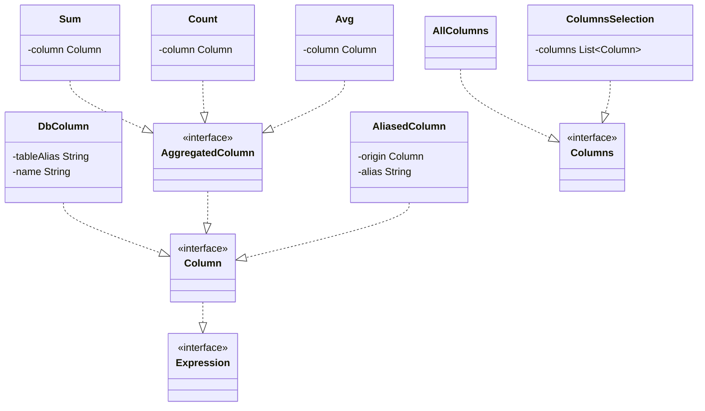
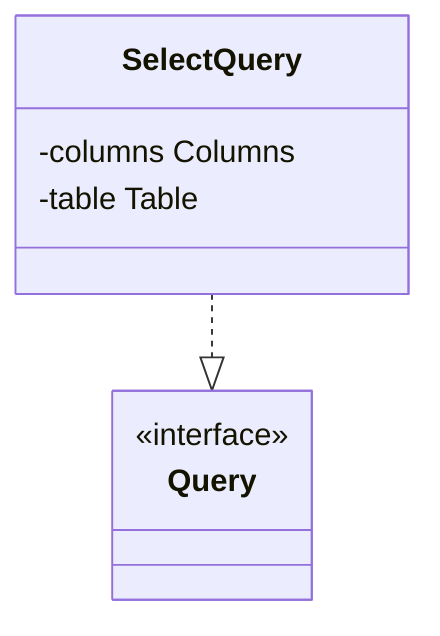
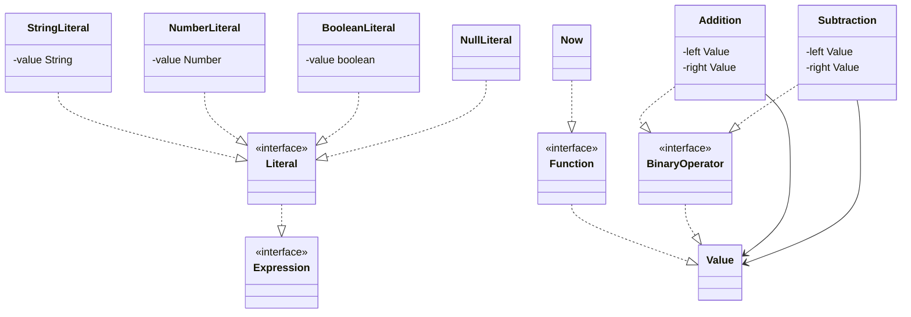
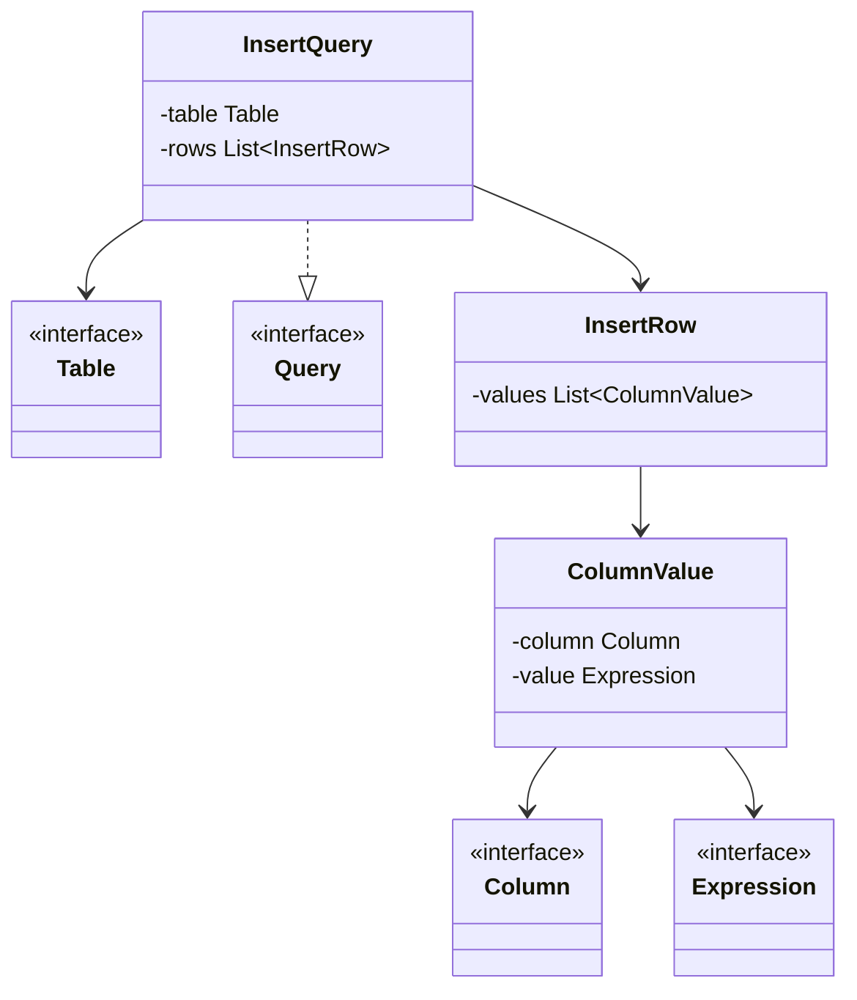
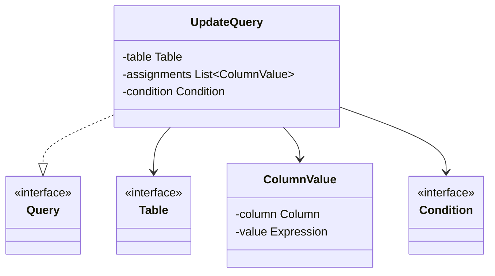
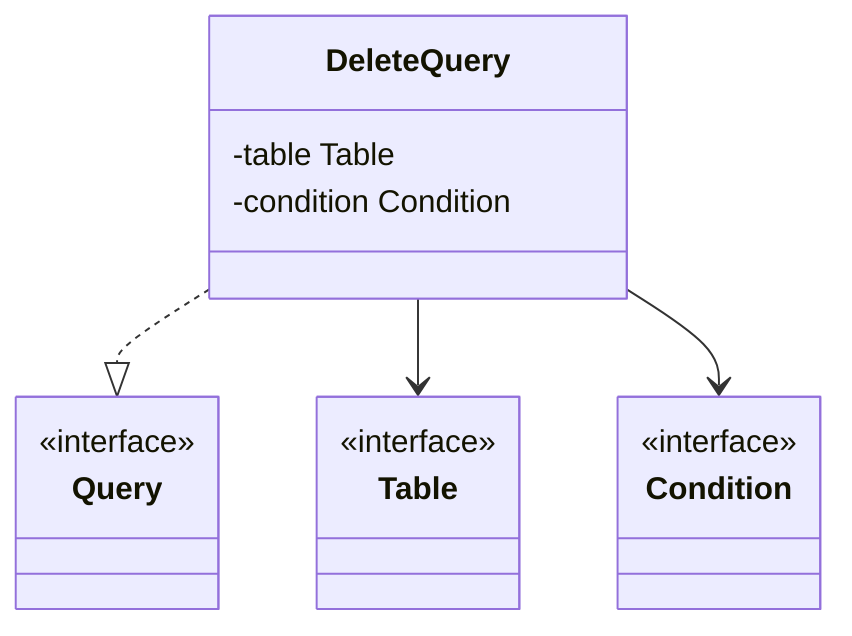

    


# Пример запроса кода
## Схема данных

```java
interface UsersTable extends FilterableTable {
    Column id();
    Column username();
    Column status();
    Column createdAt();
}

interface OrdersTable extends FilterableTable {
    Column userId();
    Column amount();
}

class DbUsersTable implements UsersTable {
    private final String name;
    DbUsersTable(String name) { this.name = name; }
    public Column id()        { return new DbColumn(name, "id"); }
    public Column username()  { return new DbColumn(name, "username"); }
    public Column status()    { return new DbColumn(name, "status"); }
    public Column createdAt() { return new DbColumn(name, "created_at"); }
}

class DbOrdersTable implements OrdersTable {
    private final String name;
    DbOrdersTable(String name) { this.name = name; }
    public Column userId() { return new DbColumn(name, "user_id"); }
    public Column amount() { return new DbColumn(name, "amount"); }
}
```

## Select query
```java
UsersTable  users  = new DbUsersTable("users");
OrdersTable orders = new DbOrdersTable("orders");

var joined = new JoinedTable<>(
    users,
    orders,
    new InnerJoin(new Equals(users.id(), orders.userId()))
);

var filtered = new FilteredTable<>(
    joined,
    new Equals(joined.left().status(), new StringLiteral("active"))
);

var limited = new LimitedTable<>(filtered, 10);

Query query = new SelectQuery(
    new ColumnsSelection(
        limited.origin().origin().left().id(),
        limited.origin().origin().left().username(),
        limited.origin().origin().right().amount()
    ),
    limited
);
```

### Итоговый SQL
```sql
SELECT users.id, users.username, orders.amount AS total
FROM users
JOIN orders ON users.id = orders.user_id
WHERE users.status = 'active'
LIMIT 10
```

## Aggregate query

```java
UsersTable  users  = new DbUsersTable("users");
OrdersTable orders = new DbOrdersTable("orders");

var joined = new JoinedTable<>(
    users,
    orders,
    new InnerJoin(new Equals(users.id(), orders.userId()))
);

var grouped = new GroupedTable<>(joined, joined.left().status());

Query query = new SelectQuery(
    new ColumnsSelection(
        grouped.origin().left().status(),
        new AliasedColumn(new Sum(grouped.origin().right().amount()), "total_amount")
    ),
    grouped
);
```

### Итоговый SQL
```sql
SELECT users.status, SUM(orders.amount) AS total_amount
FROM users
JOIN orders ON users.id = orders.user_id
GROUP BY users.status
```

## Insert query

```java
UsersTable users = new DbUsersTable("users");

Query insert = new InsertQuery(
    users,
    List.of(
        new InsertRow(
            new ColumnValue(users.id(),        new NumberLiteral(1)),
            new ColumnValue(users.username(),  new StringLiteral("john")),
            new ColumnValue(users.status(),    new StringLiteral("active")),
            new ColumnValue(users.createdAt(), new Now())
        )
    )
);
```

### Итоговый SQL
```sql
INSERT INTO users (id, username, status, created_at) VALUES (1, 'john', 'active', NOW())
```

## Update query

```java
UsersTable users = new DbUsersTable("users");

Query update = new UpdateQuery(
    users,
    List.of(
        new ColumnValue(users.status(), new StringLiteral("inactive"))
    ),
    new Equals(users.id(), new NumberLiteral(1))
);
```

### Итоговый SQL
```sql
UPDATE users SET status = 'inactive' WHERE id = 1
```

## Delete query

```java
UsersTable users = new DbUsersTable("users");

Query delete = new DeleteQuery(
    users,
    new Equals(users.id(), new NumberLiteral(1))
);
```

### Итоговый SQL
```sql
DELETE FROM users WHERE id = 1
```
