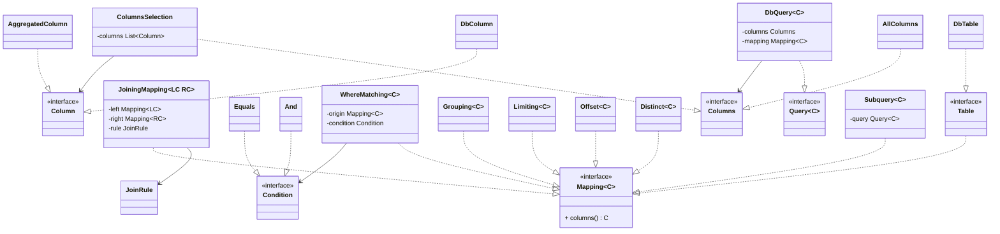

```mermaid
classDiagram
    class Mapping~C~ {
        <<interface>>
        + columns() C
    }

    class Table {
        <<interface>>
    }
    Table ..|> Mapping

    class DbTable
    DbTable ..|> Table

    class JoinRule

    class JoiningMapping~LC RC~ {
        -left Mapping~LC~
        -right Mapping~RC~
        -rule JoinRule
    }
    JoiningMapping --> JoinRule
    JoiningMapping ..|> Mapping

    class Condition {
        <<interface>>
    }

    class Equals
    Equals ..|> Condition
    class And
    And ..|> Condition

    class WhereMatching~C~ {
        -origin Mapping~C~
        -condition Condition
    }
    %% надо сделать так, чтобы WHERE нельзя было писать после Transformation
    WhereMatching ..|> Mapping
    WhereMatching --> Condition

    class Grouping~C~
    Grouping ..|> Mapping

    class Limiting~C~
    Limiting ..|> Mapping

    class Offset~C~
    Offset ..|> Mapping

    class Distinct~C~
    Distinct ..|> Mapping

    %% спроектировать HAVING

    class Column {
        <<interface>>
    }

    class DbColumn
    DbColumn ..|> Column

    class AggregatedColumn
    AggregatedColumn ..|> Column

    class Columns {
        <<interface>>
    }

    class AllColumns
    AllColumns ..|> Columns

    class ColumnsSelection {
        -columns List~Column~
    }
    ColumnsSelection ..|> Columns
    ColumnsSelection --> Column

    class Subquery~C~ {
        -query Query~C~
    }
    Subquery ..|> Mapping

    class Query~C~ {
        <<interface>>
    }

    class DbQuery~C~ {
        -columns Columns
        -mapping Mapping~C~
    }
    DbQuery ..|> Query
    DbQuery --> Columns

    %% алиасы для таблиц и столбцов
```
