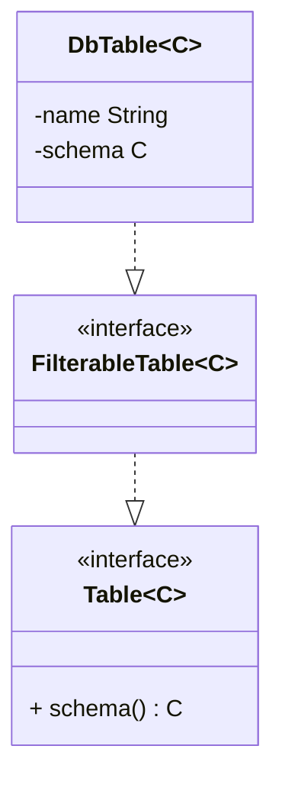
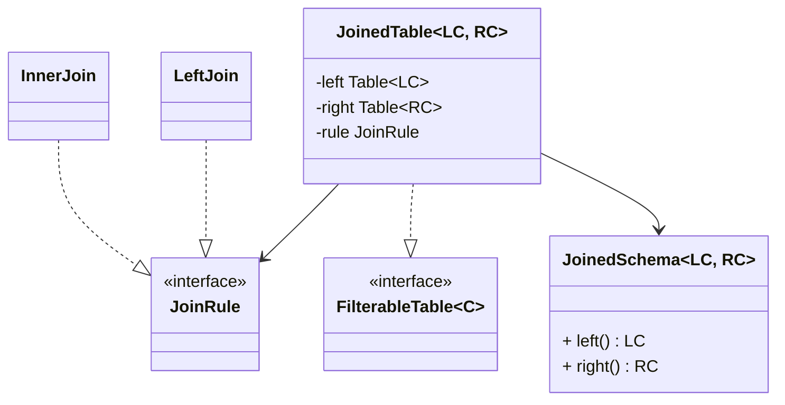
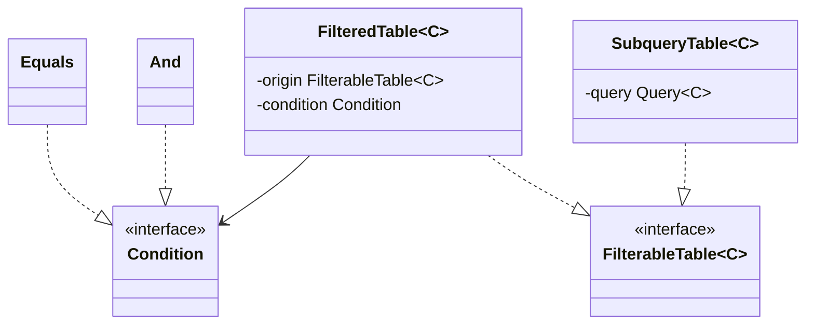
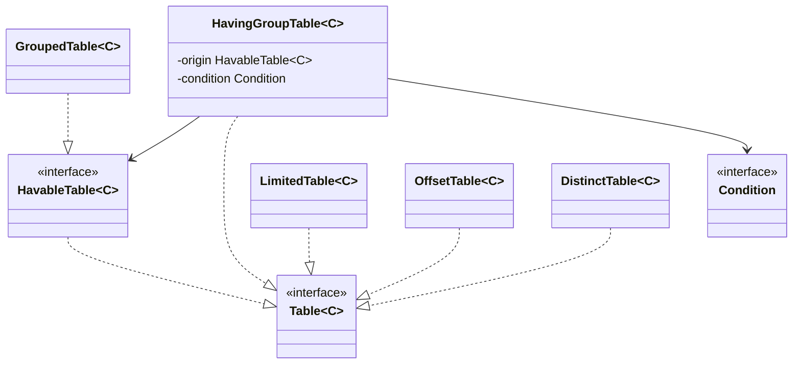
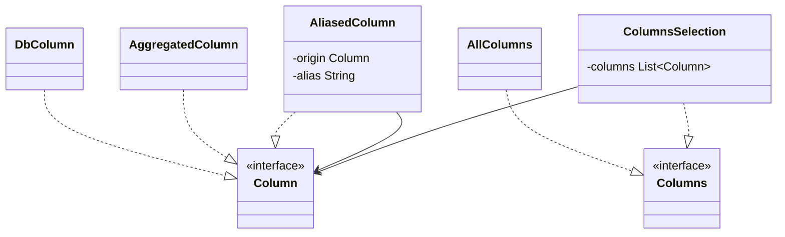
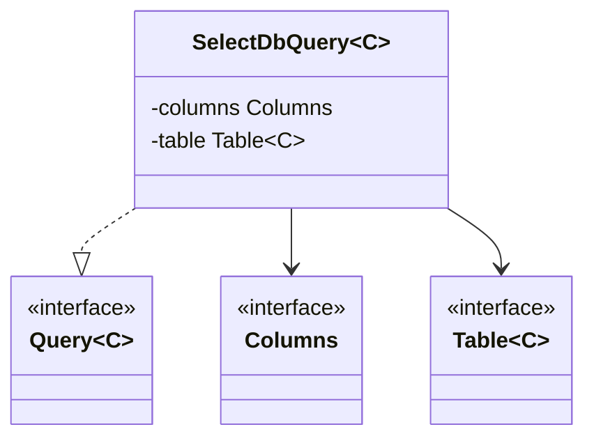
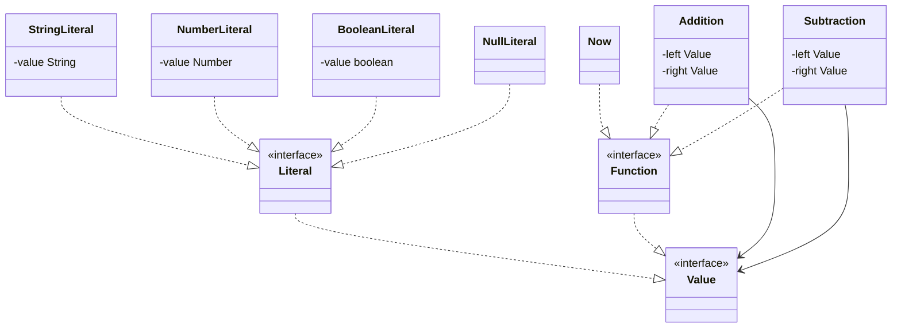
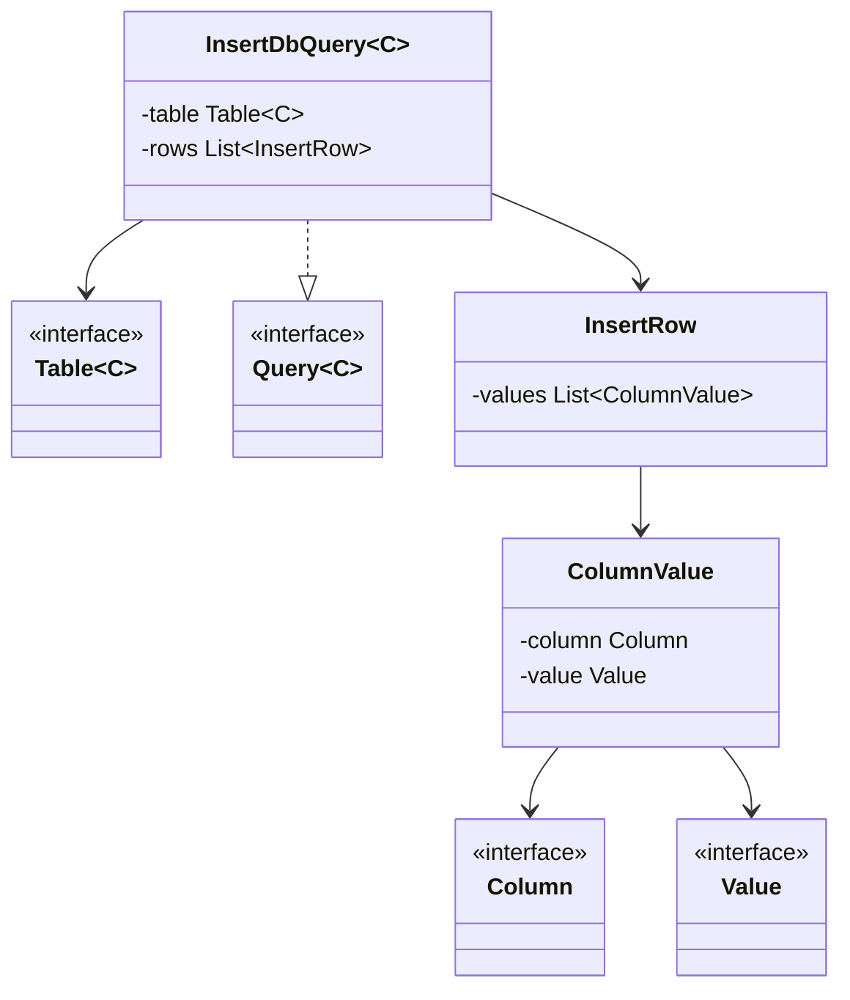
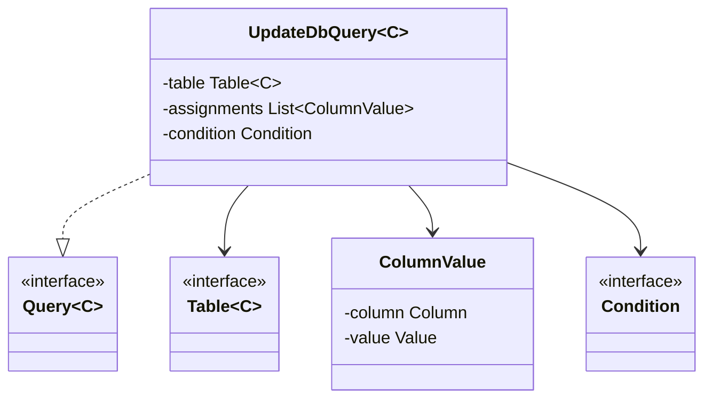
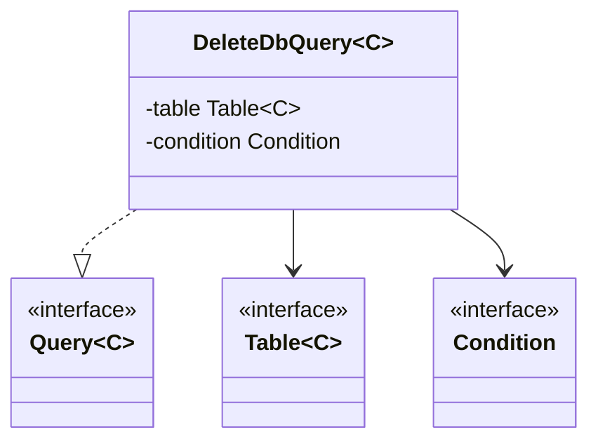

    


# Пример запроса кода
## Схема данных

<!-- Это компросисс на который прошлось пойти ради статической типизации. -->
```java
class UsersSchema {
    final Column id        = new DbColumn("id");
    final Column username  = new DbColumn("username");
    final Column status    = new DbColumn("status");
    final Column createdAt = new DbColumn("created_at");
}

class OrdersSchema {
    final Column userId = new DbColumn("user_id");
    final Column amount = new DbColumn("amount");
}
```

## Select query
```java
Table<UsersSchema>  users  = new DbTable<>("users",  new UsersSchema());
Table<OrdersSchema> orders = new DbTable<>("orders", new OrdersSchema());

Table<JoinedScema<UsersSchema, OrdersSchema>> joined = new JoinedTable<>(
    users,
    orders,
    new InnerJoin(users.schema().id, orders.schema().userId)
);

Table<JoinedScema<UsersSchema, OrdersSchema>> filtered = new ConditionFiltedTable<>(
    joined,
    new Equals(joined.schema().left().status, new StringLiteral("active"))
);

Table<JoinedScema<UsersSchema, OrdersSchema>> limited = new LimitedTable<>(filtered, 10);

Query<?> query = new SelectDbQuery<>(
    new ColumnsSelection(
        joined.schema().left().id,
        joined.schema().left().username,
        joined.schema().right().amount
    ),
    limited
);
```

### Итоговый SQL
```sql
SELECT users.id, users.username, orders.amount AS total
FROM users
JOIN orders ON users.id = orders.user_id
WHERE users.status = 'active'
LIMIT 10
```

## Aggregate query

```java
Table<UsersSchema>  users  = new DbTable<>("users",  new UsersSchema());
Table<OrdersSchema> orders = new DbTable<>("orders", new OrdersSchema());

Table<JoinedScema<UsersSchema, OrdersSchema>> joined = new JoinedTable<>(
        users,
        orders,
        new InnerJoin(users.schema().id, orders.schema().userId)
);

Table<JoinedSchema<UsersSchema, OrdersSchema>> grouped = new GroupedTable<>(
    joined,
    joined.schema().left().status
);

Query<?> query = new SelectDbQuery<>(
    new ColumnsSelection(
        joined.schema().left().status,
        new AliasedColumn(
                new AggregatedColumn("SUM", joined.schema().right().amount), 
                "total_amount"
        )
    ),
    grouped
);
```

### Итоговый SQL
```sql
SELECT users.status, SUM(orders.amount) AS total_amount
FROM users
JOIN orders ON users.id = orders.user_id
GROUP BY users.status
```

## Insert query

```java
DbTable<UsersSchema> users = new DbTable<>("users", new UsersSchema());

Query<?> insert = new InsertDbQuery<>(
    users,
    List.of(
        new InsertRow(
            new ColumnValue(users.schema().id,        new NumberLiteral(1)),
            new ColumnValue(users.schema().username,  new StringLiteral("john")),
            new ColumnValue(users.schema().status,    new StringLiteral("active")),
            new ColumnValue(users.schema().createdAt, new Now())
        )
    )
);
```

### Итоговый SQL
```sql
INSERT INTO users (id, username, status, created_at) VALUES (1, 'john', 'active', NOW())
```

## Update query

```java
DbTable<UsersSchema> users = new DbTable<>("users", new UsersSchema());

Query<?> update = new UpdateDbQuery<>(
    users,
    List.of(
        new ColumnValue(users.schema().status, new StringLiteral("inactive"))
    ),
    new Equals(users.schema().id, new NumberLiteral(1))
);
```

### Итоговый SQL
```sql
UPDATE users SET status = 'inactive' WHERE id = 1
```

## Delete query

```java
DbTable<UsersSchema> users = new DbTable<>("users", new UsersSchema());

Query<?> delete = new DeleteDbQuery<>(
    users,
    new Equals(users.schema().id, new NumberLiteral(1))
);
```

### Итоговый SQL
```sql
DELETE FROM users WHERE id = 1
```
