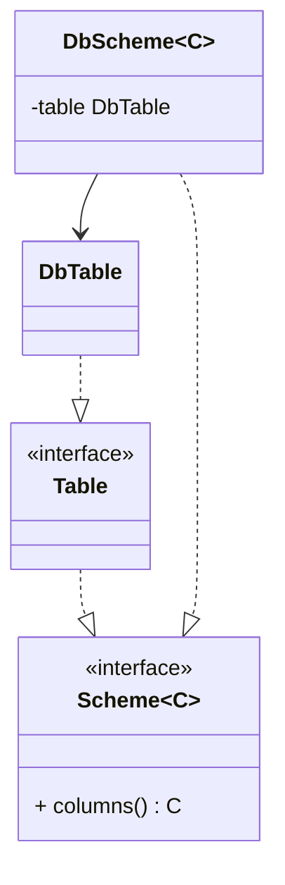
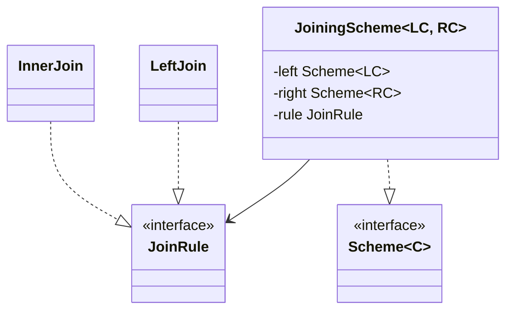
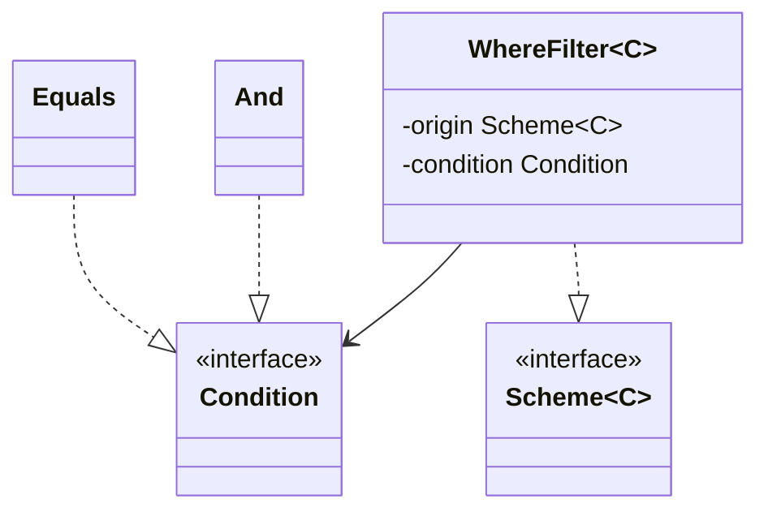
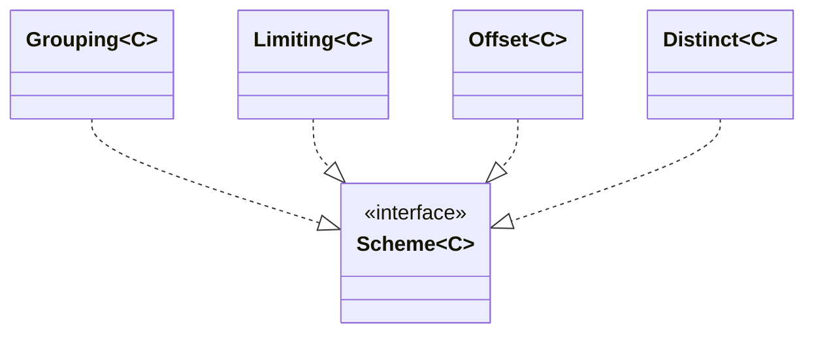
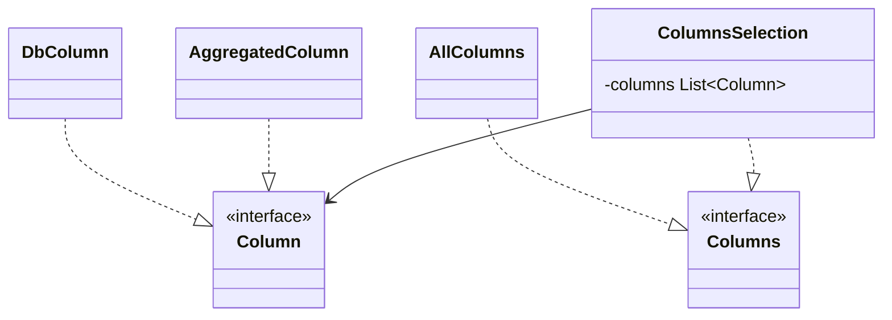
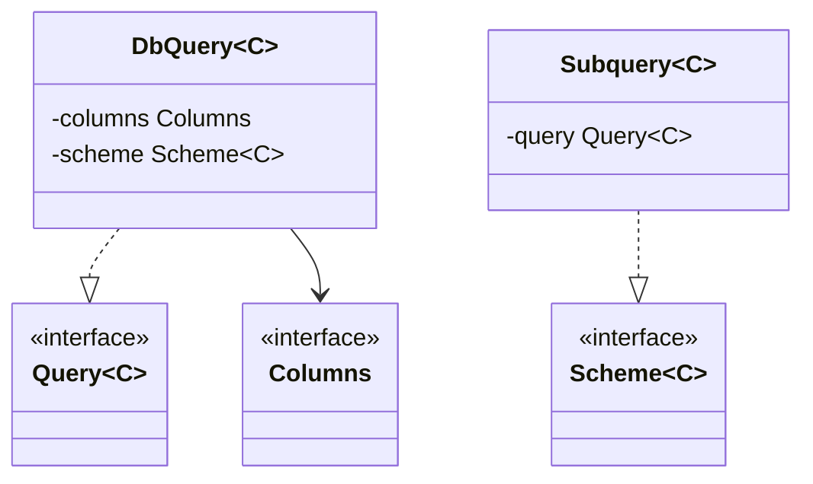

# Пример запроса кода
## Схема данных
```java
class UsersColumns {
    final Column id       = new DbColumn("id");
    final Column username = new DbColumn("username");
    final Column status   = new DbColumn("status");
}

class OrdersColumns {
    final Column userId = new DbColumn("user_id");
    final Column amount = new DbColumn("amount");
}
```

```java
Scheme<UsersColumns>  users  = new DbScheme<>(new DbTable("users"),  new UsersColumns());
Scheme<OrdersColumns> orders = new DbScheme<>(new DbTable("orders"), new OrdersColumns());

JoiningScheme<UsersColumns, OrdersColumns> joined = new JoiningScheme<>(
    users,
    orders,
    new InnerJoin(users.columns().id, orders.columns().userId)
);

Scheme<JoinedColumns<UsersColumns, OrdersColumns>> filtered = new WhereFilter<>(
    joined,
    new Equals(joined.columns().left().status, new Literal("active"))
);

Scheme<JoinedColumns<UsersColumns, OrdersColumns>> limited = new Limiting<>(filtered, 10);

Query<?> query = new DbQuery<>(
    new ColumnsSelection(
        joined.columns().left().id,
        joined.columns().left().username,
        joined.columns().right().amount
    ),
    limited
);
```

## Итоговый SQL
```sql
SELECT users.id, users.username, orders.amount
FROM users
JOIN orders ON users.id = orders.user_id
WHERE users.status = 'active'
LIMIT 10
```
