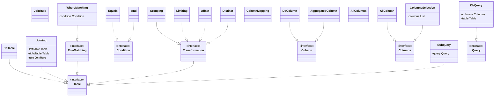

```mermaid
classDiagram
    class Table {
        <<interface>>
    }
    
    class DbTable 
    DbTable ..|> Table
    
    class JoinRule
    
    class Joining {
        -leftTable Table
        -rightTable Table
        -rule JoinRule
    }
    Joining ..|> Table
    
    
    class RowMatching {
        <<interface>>
    }
    %% возможно где-то Table стоит заменить на синоним типа Data, Selected и т.д.
    RowMatching ..|> Table 
    
    class WhereMatching {
        condition Condition
    }
    %% надо сделать так, чтобы WHERE нельзя было писать после Transformation
    %% при том Transformation должна принимать и просто таблицу, и "прореженную"
    WhereMatching ..|> RowMatching
    
    class Condition {
        <<interface>>
    }
    
    class Equals
    Equals ..|> Condition
    class And
    And ..|> Condition
    
    class Transformation { 
        <<interface>>
    }
    Transformation ..|> Table
    
    class Grouping 
    Grouping ..|> Transformation
    
    class Limiting
    Limiting ..|> Transformation
    
    class Offset
    Offset ..|> Transformation
    
    class Distinct
    Distinct ..|> Transformation
    
    %% спроектировать HAVING
    
    class ColumnMapping 
    
    class Column {
        <<interface>>
    }
    
    class DbColumn 
    DbColumn ..|> Column

    class AggregatedColumn
    AggregatedColumn ..|> Column
    
    class Columns {
        <<interface>>
    }
    
    class AllColumns
    AllColumn ..|> Columns
    
    class ColumnsSelection {
        -columns List<Column>
    }
    ColumnsSelection ..|> Columns

    class Subquery {
        -query Query
    }
    Subquery ..|> Table

    class Query {
        <<interface>>
    }

    class DbQuery {
        -columns Columns
        -table Table
    }
    DbQuery ..|> Query
    
    %% алиасы для таблиц и столбцов
```