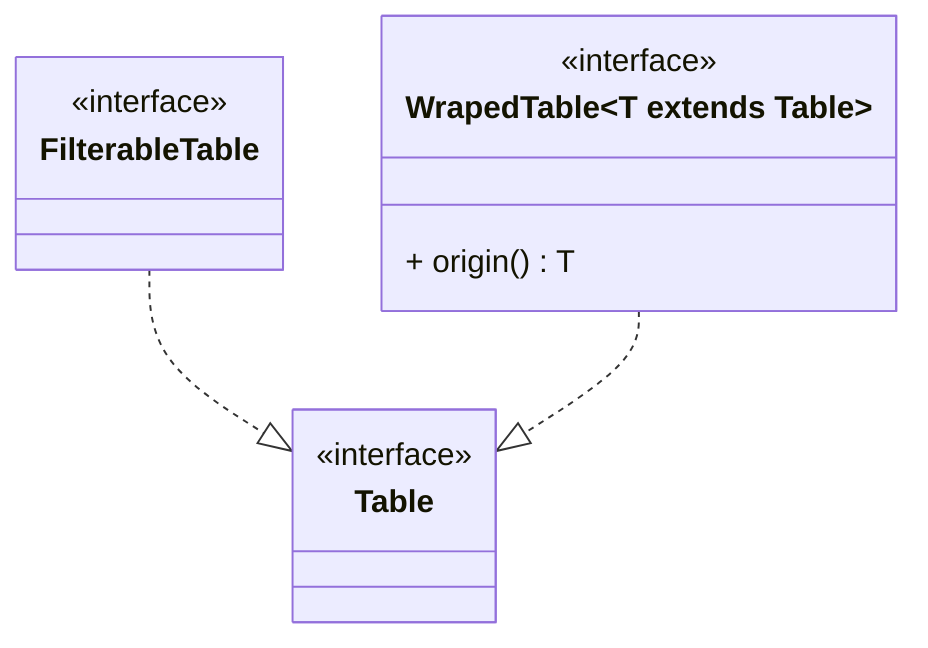
```mermaid
classDiagram
    class Table {
        <<interface>>
    }

    class FilterableTable {
        <<interface>>
    }
    FilterableTable ..|> Table

    class WrapedTable~T extends Table~ {
        <<interface>>
        + origin() T
    }
    WrapedTable ..|> Table
```

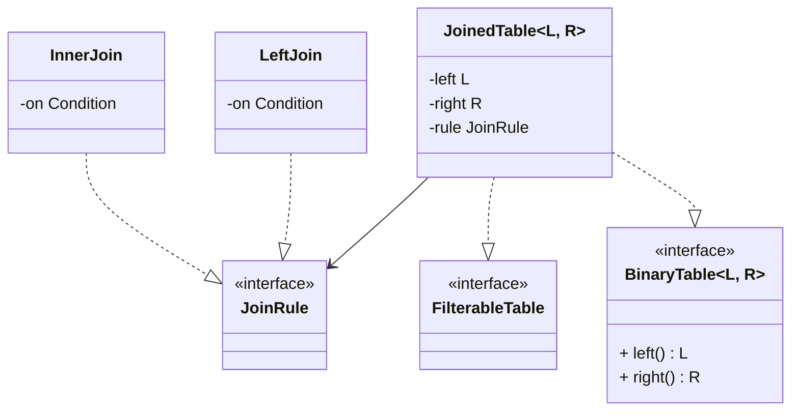
```mermaid
classDiagram
    class FilterableTable {
        <<interface>>
    }

    class JoinRule {
        <<interface>>
    }

    class InnerJoin {
        -on Condition
    }
    InnerJoin ..|> JoinRule

    class LeftJoin {
        -on Condition
    }
    LeftJoin ..|> JoinRule

    class BinaryTable~L, R~ {
        <<interface>>
        + left() L
        + right() R
    }

    class JoinedTable~L, R~ {
        -left L
        -right R
        -rule JoinRule
    }
    JoinedTable ..|> FilterableTable
    JoinedTable ..|> BinaryTable~L, R~
    JoinedTable --> JoinRule
```

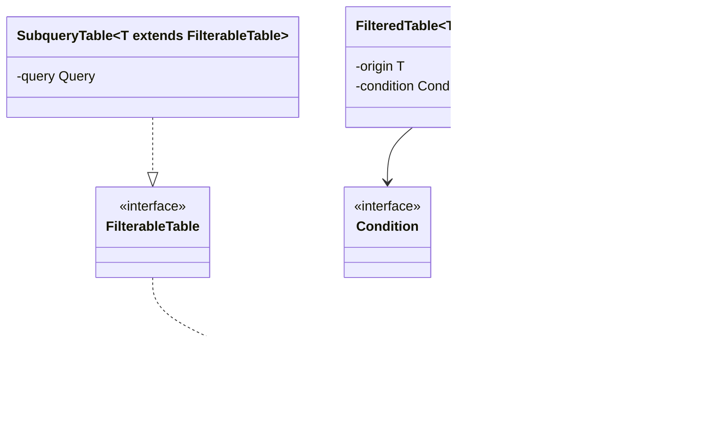
```mermaid
classDiagram
    class Table {
        <<interface>>
    }

    class FilterableTable {
        <<interface>>
    }
    FilterableTable ..|> Table

    class Condition {
        <<interface>>
    }

    class WrapedTable~T extends Table~ {
        <<interface>>
        + origin() T
    }
    WrapedTable ..|> Table

    class FilteredTable~T extends FilterableTable~ {
        -origin T
        -condition Condition
    }
    FilteredTable ..|> WrapedTable~T~
    FilteredTable --> Condition

    class SubqueryTable~T extends FilterableTable~ {
        -query Query
    }
    SubqueryTable ..|> FilterableTable
```

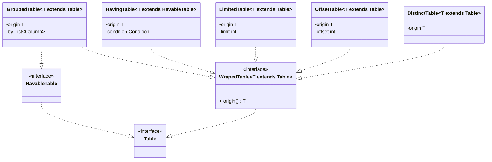
```mermaid
classDiagram
    class Table {
        <<interface>>
    }

    class HavableTable {
        <<interface>>
    }
    HavableTable ..|> Table

    class WrapedTable~T extends Table~ {
        <<interface>>
        + origin() T
    }
    WrapedTable ..|> Table

    class GroupedTable~T extends Table~ {
        -origin T
        -by List~Column~
    }
    GroupedTable ..|> HavableTable
    GroupedTable ..|> WrapedTable~T~

    class HavingTable~T extends HavableTable~ {
        -origin T
        -condition Condition
    }
    HavingTable ..|> WrapedTable~T~

    class LimitedTable~T extends Table~ {
        -origin T
        -limit int
    }
    LimitedTable ..|> WrapedTable~T~

    class OffsetTable~T extends Table~ {
        -origin T
        -offset int
    }
    OffsetTable ..|> WrapedTable~T~

    class DistinctTable~T extends Table~ {
        -origin T
    }
    DistinctTable ..|> WrapedTable~T~
```

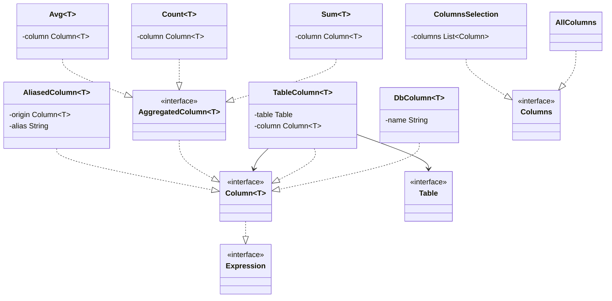
```mermaid
classDiagram
    class Expression {
        <<interface>>
    }

    class Column~T~ {
        <<interface>>
    }
    Column ..|> Expression

    class DbColumn~T~ {
        -name String
    }
    DbColumn ..|> Column~T~

    class Table {
        <<interface>>
    }

    class TableColumn~T~ {
        -table Table
        -column Column~T~
    }
    TableColumn ..|> Column~T~
    TableColumn --> Column
    TableColumn --> Table

    class AggregatedColumn~T~ {
        <<interface>>
    }
    AggregatedColumn ..|> Column~T~

    class Sum~T~ {
        -column Column~T~
    }
    Sum ..|> AggregatedColumn~T~

    class Count~T~ {
        -column Column~T~
    }
    Count ..|> AggregatedColumn~T~

    class Avg~T~ {
        -column Column~T~
    }
    Avg ..|> AggregatedColumn~T~

    class AliasedColumn~T~ {
        -origin Column~T~
        -alias String
    }
    AliasedColumn ..|> Column~T~

    class Columns {
        <<interface>>
    }

    class AllColumns
    AllColumns ..|> Columns

    class ColumnsSelection {
        -columns List~Column~
    }
    ColumnsSelection ..|> Columns
```

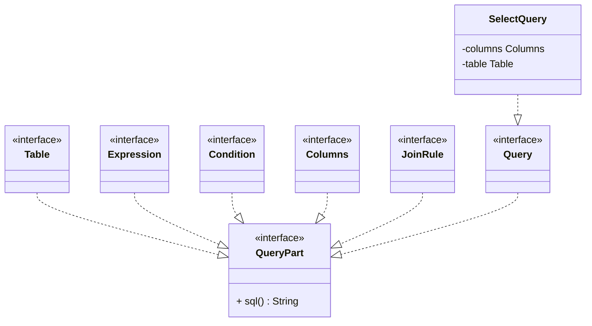
```mermaid
classDiagram
    class QueryPart {
        <<interface>>
        + sql() String
    }

    class Table {
        <<interface>>
    }
    Table ..|> QueryPart

    class Expression {
        <<interface>>
    }
    Expression ..|> QueryPart

    class Condition {
        <<interface>>
    }
    Condition ..|> QueryPart

    class Columns {
        <<interface>>
    }
    Columns ..|> QueryPart

    class JoinRule {
        <<interface>>
    }
    JoinRule ..|> QueryPart

    class Query {
        <<interface>>
    }
    Query ..|> QueryPart

    class SelectQuery {
        -columns Columns
        -table Table
    }
    SelectQuery ..|> Query
```

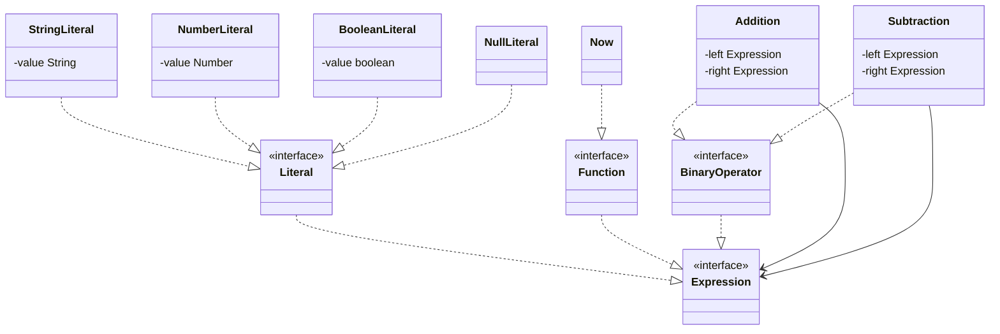
```mermaid
classDiagram
    class Expression {
        <<interface>>
    }

    class Literal {
        <<interface>>
    }
    Literal ..|> Expression

    class StringLiteral {
        -value String
    }
    StringLiteral ..|> Literal

    class NumberLiteral {
        -value Number
    }
    NumberLiteral ..|> Literal

    class BooleanLiteral {
        -value boolean
    }
    BooleanLiteral ..|> Literal

    class NullLiteral
    NullLiteral ..|> Literal

    class Function {
        <<interface>>
    }
    Function ..|> Expression

    class Now
    Now ..|> Function

    class BinaryOperator {
        <<interface>>
    }
    BinaryOperator ..|> Expression

    class Addition {
        -left Expression
        -right Expression
    }
    Addition ..|> BinaryOperator
    Addition --> Expression

    class Subtraction {
        -left Expression
        -right Expression
    }
    Subtraction ..|> BinaryOperator
    Subtraction --> Expression
```

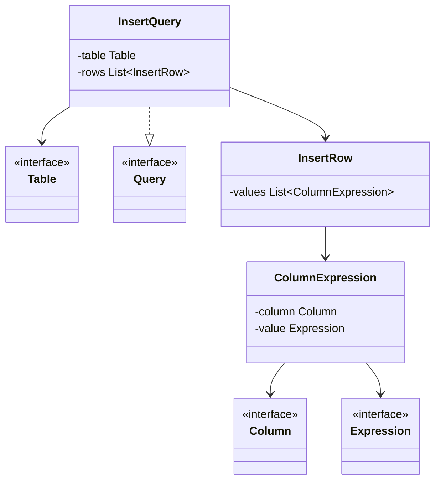
```mermaid
classDiagram
    class Table {
        <<interface>>
    }
    
    class Query {
        <<interface>>
    }

    class Expression {
        <<interface>>
    }

    class Column {
        <<interface>>
    }

    class ColumnExpression {
        -column Column
        -value Expression
    }
    ColumnExpression --> Column
    ColumnExpression --> Expression

    class InsertRow {
        -values List~ColumnExpression~
    }
    InsertRow --> ColumnExpression

    class InsertQuery {
        -table Table
        -rows List~InsertRow~
    }
    InsertQuery ..|> Query
    InsertQuery --> Table
    InsertQuery --> InsertRow
```

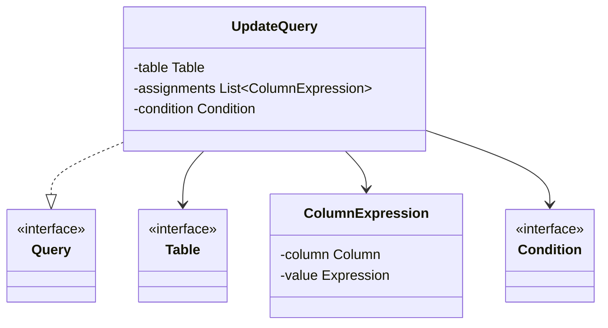
```mermaid
classDiagram
    class Table {
        <<interface>>
    }

    class Query {
        <<interface>>
    }

    class Condition {
        <<interface>>
    }

    class ColumnExpression {
        -column Column
        -value Expression
    }

    class UpdateQuery {
        -table Table
        -assignments List~ColumnExpression~
        -condition Condition
    }
    UpdateQuery ..|> Query
    UpdateQuery --> Table
    UpdateQuery --> ColumnExpression
    UpdateQuery --> Condition
```
    
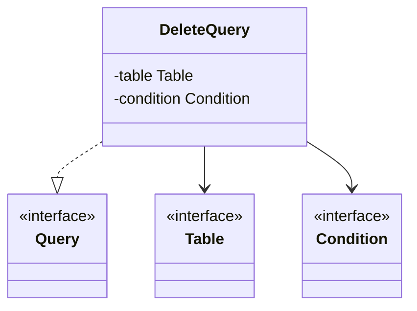
```mermaid
classDiagram
    class Table {
        <<interface>>
    }

    class Query {
        <<interface>>
    }

    class Condition {
        <<interface>>
    }

    class DeleteQuery {
        -table Table
        -condition Condition
    }
    DeleteQuery ..|> Query
    DeleteQuery --> Table
    DeleteQuery --> Condition
```

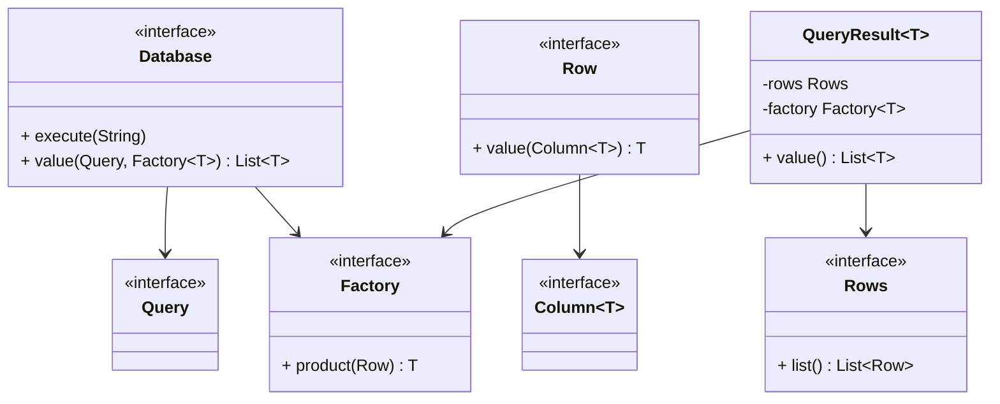
```mermaid
classDiagram
    class Query {
        <<interface>>
    }

    class Database {
        <<interface>>
        + execute(String)
        + value(Query, Factory~T~) List~T~
    }
    Database --> Query
    Database --> Factory

    class Rows {
        <<interface>>
        + list() List~Row~
    }

    class Column~T~ {
        <<interface>>
    }

    class Row {
        <<interface>>
        + value(Column~T~) T
    }
    Row --> Column

    class Factory~T~ {
        <<interface>>
        + product(Row) T
    }

    class QueryResult~T~ {
        -rows Rows
        -factory Factory~T~
        + value() List~T~
    }
    QueryResult --> Rows
    QueryResult --> Factory
```
